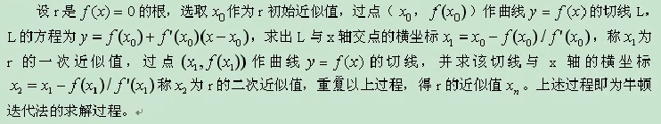
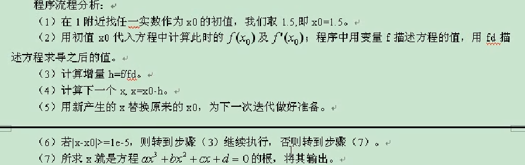
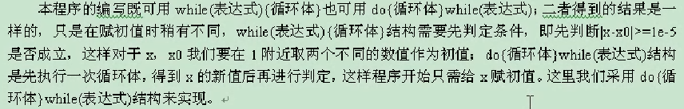

# 数据结构与算法

## 百钱百鸡问题

> 中国古代数学家张丘建在他的《算经》中提出了一个著名的“百钱百鸡问题”：一只公鸡值5钱，一只母鸡值3前，三只小鸡值1钱，现在要用百钱买百鸡，请问公鸡、母鸡、小鸡各多少只？

### 分析公式

- cock + hen + chicken = 100
- 5*cock + 3*hen + chicken/3 = 100

### 算法设计

- 穷举法
- 三重循环

[源码](./source/100_chicken.c)

## 借书方案知多少

### 问题描述

Alice 有五本新书，要借给A，B，C三位小朋友，若每人每次只能借一本，则可以有多少种不同的借法？

### 问题分析

裴烈组合问题，即求从5个数中取3个不同数的排列组合的总数。

- 算法设计：穷举法、三重循环

[源码](./source/borrow_books.c)

## 打鱼还是晒网

- 问题描述

某人从1990年1月1日起开始“三天打鱼两天晒网”，问这个人在以后的某一天是“打鱼”还是“晒网”

- 问题分析

1. 计算从1990-1-1 开始至指定日期共有多少天；
2. 由于“打鱼”和“晒网”的周期为5天，所以将计算出的天数用5去除；
3. 根据余数判断他是是在“打鱼”还是在“晒网”；

若余数为1,2,3，则他是在“打鱼”，否则实在“晒网”

- 算法设计

该算法为数值计算算法，要利用循环求出指定日期距1990-1-1的天数，并考虑到循环过程中的闰年情况。闰年二月为29天，平年二月为28天。

判断闰年的方法可以用伪语句描述如下：如果（能被4整除并且不能被100整除）或者（能被400整除）则该年是闰年；否则不是闰年；

[源码](./source/fishing-net.c)

## 抓交通肇事犯

- 问题描述
  - 一个卡车违反交通规则，撞人后逃跑。现场有三人目击事件，但都没有记住车号，只记下车号的一些特征，但都没有记住车号，只记下车号的一些特征。甲说：牌照的前两位数字是相同的；乙说：牌照的后两位数字是相同的，但与前两位不同；丙是数学家，他说：四位的车号刚好是一个整数的平方。请根据以上线索求出车号

- 问题分析
  - 按照题目的要求构造出一个前两位书相同、后两位数相同且相互间又不同的4位整数，然后判断该整数是否是另一个整数的平方。

- a1 = a2, 1 <= a1 <= 9, 0<= a2 <= 9
- a3 = a4, 0 <= a3, a4 <= 9
- a1 != a3
- 1000*a1 + 100*a2 + 10a4+a4 = x^2 xeZ

- 算法设计
  - 数值计算问题，需要求解不定方程组
  - 对于求解不定方程组的问题，一般采用穷举法

[源码](./source/fishing-net.c)

## 兔子问题

- 问题描述：有一队兔子，从出生后的第3个月起每个月都生一对兔子。小兔子涨到第3个月后每个月又生一对兔子，假设所有的兔子都不死，问30个月内每个月的兔子总数为多少？

- 问题分析

| 约数 | 小兔子对数 | 中兔子对数 | 老兔子对数 | 兔子总数 |
| ---- | --------  | --------- | --------- | ------- |
|   1  |     1     |     0     |    0      |     1   |
|   2  |     0     |     1     |    0      |     1   |
|   3  |     1     |     0     |    1      |     2   |
|   4  |     1     |     1     |    1      |     3   |
|   5  |     2     |     1     |    2      |     5   |
|   6  |     3     |     2     |    3      |     8   |
|   7  |     5     |     3     |    5      |    13   |

- 算法设计
  - 迭代循环，即是一个不断用新值取代变量的旧值，然后由变量旧值传递推出变量新值的过程。这种迭代与如下因素有关：初值、迭代公司、迭代次数。

- 算法设计：迭代公式为
  - fib1 = fib2 = 1(n=1,2) 初值
  - fibn = fib(n-1) + fib(n-2) (n>=3) 迭代公式

## 牛顿迭代法求方程根

- 问题描述：
  - 编写牛顿迭代法求方程根的波函数。方程为 ax^3 + bx^2 + cx + d = 0, 系数 a,b,c,d 由主函数输入。求 x 在1附近的一个实根。求出根后，由主函数输出。

  - 牛顿迭代法的公式是：
    - x = Xo - (f(Xo)/f1(Xo))
    - 设迭代到 |X-Xo| <= 10^5 时结束

- 问题分析：
  - 牛顿迭代法是取Xo之后，在这个基础上，找到比Xo更接近的方程的根，一步一步迭代，从而找到更接近方程根的近视根。

- 算法设计：

[牛顿迭代法](https://baike.baidu.com/item/%E7%89%9B%E9%A1%BF%E8%BF%AD%E4%BB%A3%E6%B3%95/10887580?fr=aladdin)

## 最佳存款方案

- 问题描述
  - 假设银行一年整存零取得月息为0.63%。现在某人手中有一笔钱，他打算在今后的五年中的每年年底取出1000元，到第5年时刚好去完，请算出他取钱时应存入多少？

- 问题分析
  - 从第5年向前推算。已知“在今后的5年中每年的年底取出1000元，这样到5年的时候刚好可以取完”，因此，第5年年底会取出1000元，则可以计算出第5年年初在银行中所存的钱数为：
  - 第5年年初存款数=1000(1+12*0.0063)
  - 第4年年初存款数=( 第5年年初存款数+1000)/(1+12*0.0063)
  - 第3年年初存款数=( 第4年年初存款数+1000)/(1+12*0.0063)
  - 第2年年初存款数=( 第3年年初存款数+1000)/(1+12*0.0063)
  - 第1年年初存款数=( 第2年年初存款数+1000)/(1+12*0.0063)

- 算法设计
  - for循环4此，每次循环都在上一次的基础上加上1000，在除以(1+12*0.0063)

[源码](./source/money.c)